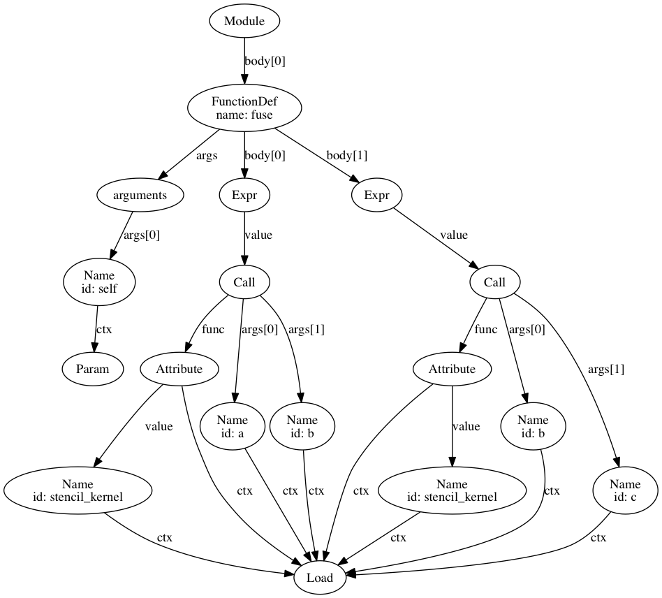
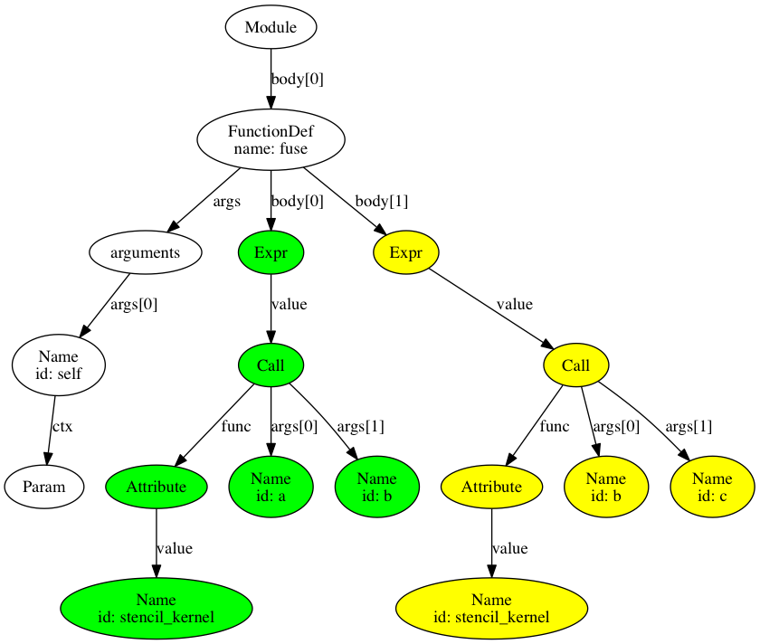
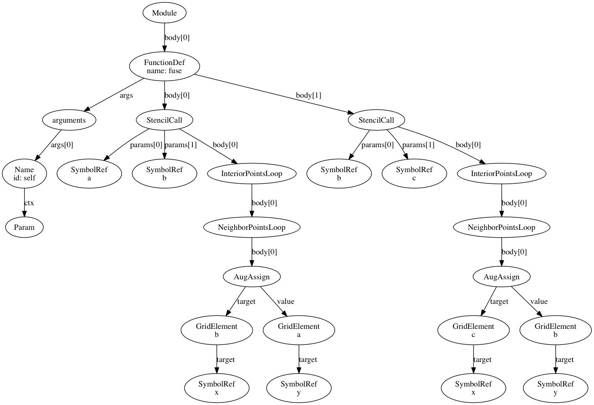
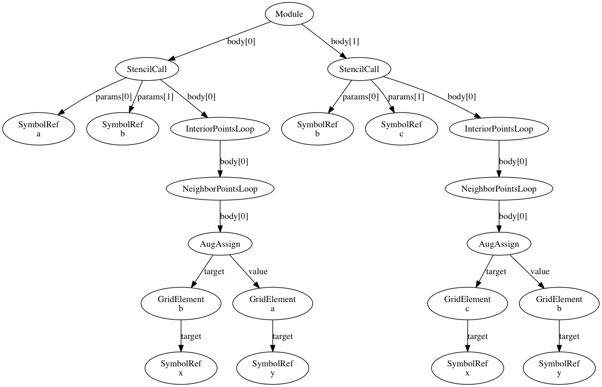
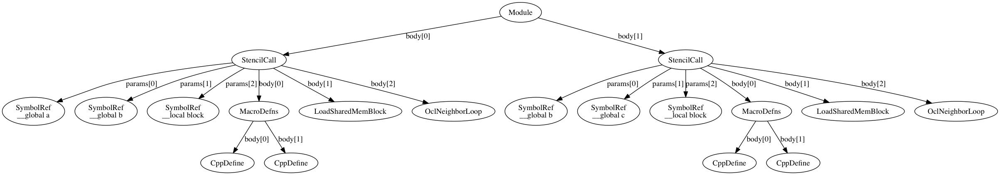
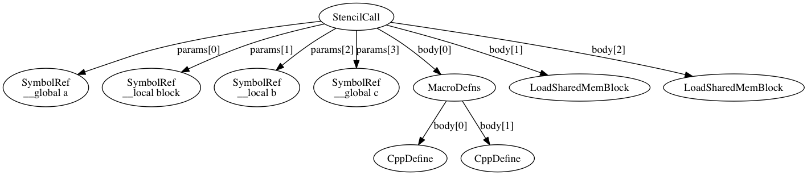
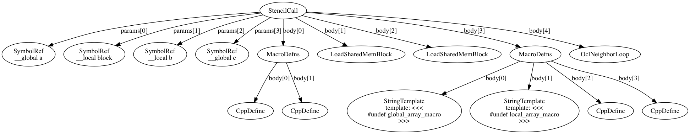

.. code:: python

    import sys
    sys.path.append('/Users/leonardtruong/aspire_projects/pycl')
    sys.path.append('/Users/leonardtruong/aspire_projects/stencil_code')
    sys.path.append('/Users/leonardtruong/aspire_projects/ctree')
Fusing Stencils
===============

This example will explore the fusion of two successive calls to a
Stencil Specializer. Our goal here is to reduce the amounts of reads and
writes to global memory by leveraging temporal locality. The high level
model is that once we have computed a block of the output of our first
stencil, we can use the computed elements to compute the corresponding
block in the output of the second stencil.

Motiviation
^^^^^^^^^^^

By reusing the values stored in local memory to compute the final output
block before continuing, we have to perform half the amount of writes to
global memory. The tradeoff here is that due to ghost zones, there will
be portions of our intermediate matrix that must be recomputed for
multiple blocks.

Performance Results
^^^^^^^^^^^^^^^^^^^

The initial results with a simple ghost zone of size 1 show that a fused
stencil will outperform the normal execution of two stencils on larger
inputs. More investigation is needed for matrices of varying sizes and
stencils of varying ghost depths.

Implications
^^^^^^^^^^^^

By proving that fusion between stencils is possible, and a good choice
in some situations, we can now explore the tuning space of whether or
not to fuse two stencils. A possible model would involve analyzing at
the size of the input matrix as well as the size of the ghost zone.

Setup
=====

First we will import StencilKernel and StencilGrid which are necessary
for using our Stencil Specialize and define a simple stencil kernel.

.. code:: python

    from stencil_code.stencil_kernel import StencilKernel
    from stencil_code.stencil_grid import StencilGrid
    
    class Kernel(StencilKernel):
        def kernel(self, in_grid, out_grid):
            for x in out_grid.interior_points():
                for y in in_grid.neighbors(x, 1):
                    out_grid[x] += in_grid[y]
    
    width = 2**10 + 2
    stencil_kernel = Kernel(backend='ocl')
    b = StencilGrid([width, width])
    b.ghost_depth = 1
    a = StencilGrid([width, width])
    a.ghost_depth = 1
    c = StencilGrid([width, width])
    c.ghost_depth = 1
    
    import numpy as np
    
    # Set the grid to be all ones.
    a.data = np.ones([width, width], dtype=np.float32) 
Annotate our fusable program
============================

To support fusion, we will need to provide the fuser with a consumable
AST representing a set of expression over which fusion (may) be
possible. The ideal fuser would be able to parse and find opportunities
for fusion, decide based on a tuning model whether or not to fuse, and
execute the program. This means that in some cases, a fuser would
perform no manipulation on the original program (i.e. a program which
has no opportunities for fusion would still be run in the same fashion.

.. code:: python

    def fuse(self):
        stencil_kernel.kernel(a, b)
        stencil_kernel.kernel(b, c)
Getting the AST
===============

.. code:: python

    from ctree.frontend import get_ast
    from ctree import ipython_show_ast, browser_show_ast
    
    tree = get_ast(fuse)
    ipython_show_ast(tree)

The following graph highlights the two subtrees corresponding to the two
expressions we are trying to fuse. I've also stripped the Load node and
ctx edges for clarity. |caption|

As you can see, the two ``Expr`` subtrees are the trees we are
interested in fusing. To do this, we will define a subclass of
``ast.NodeTransformer`` that will convert these subtrees into the
specializer's semantic model.

.. code:: python

    import ast
    
    class SemanticModelBuilder(ast.NodeTransformer):
        def get_node(self, node):
            self.current_node = node
    
        def visit_Expr(self, node):
            node.value.func.attr = 'get_semantic_node'
            node.value.args.insert(0, ast.List(elts=[ast.Str(arg.id) for arg in node.value.args], ctx=ast.Load()))
            expr = ast.Expression(
                ast.Call(
                    func=ast.Attribute(
                        value=ast.Name('self', ast.Load()),
                        attr='get_node',
                        ctx=ast.Load()
                    ),
                    args=[node.value],
                    keywords=[]
                )
            )
            expr = ast.fix_missing_locations(expr)
            exec(compile(expr, filename='', mode='eval'))
            return self.current_node
        
    SemanticModelBuilder().visit(tree)
    ipython_show_ast(tree)

Because we will not be using it, we can remove the ``FunctionDef`` node
for fuse to simplify our tree.

.. code:: python

    tree.body = tree.body[0].body
    ipython_show_ast(tree)

Because our fusion will operate on the semantic of the backend code, we
will ask the specializer to give us a semantic model that is closer to
what the traditional generated code looks like. This way, we can
manipulate the code blocks in a way that will allow us to have properly
generated code for our target, while still leveraging the semantic
notions that allow this fusion to be possible.

.. code:: python

    for index, body in enumerate(reversed(tree.body)):
        # body.backend_transform(2 * index)
        body.backend_semantic_transform(1 + index)
    ipython_show_ast(tree)

Legality must be tested before any fusion operations take place.

.. code:: python

    f1 = tree.body[0]
    f2 = tree.body[1]
    
    def fusable(f1, f2):
        # FIXME: Assuming fusability for now
        return True
    
    # Delete the current output grid
    del f1.params[-2]
    f2.params[0]._global = False
    f2.params[0]._const = False
    f2.params[0]._local = True
    f1.params.extend(f2.params[:-1])
    
    f2.remove_types_from_decl()
    f2.add_undef()
.. code:: python

    from ctree.templates.nodes import StringTemplate
    
    del f2.body[1].body[0].body[-1]
    del f1.body[2].body[0:2]
    f2.body[1].body[0].body.append(StringTemplate("b[tid] = 0.0;"))
    f2.body[1].body[0].body.append(StringTemplate("local_id0 += 1;"))
    f2.body[1].body[0].body.append(StringTemplate("local_id1 += 1;"))
    
    f2.body[1].body[0].body.extend(f1.body[2].body)
    f1.body[2] = f2.body[1]
    del f2.body[1]
    ipython_show_ast(f1)

.. code:: python

    class SymbolRenamer(ast.NodeTransformer):
        def __init__(self, old, new):
            super(SymbolRenamer, self).__init__()
            self.old = old
            self.new = new
            
        def visit_SymbolRef(self, node):
            # Weird bug, straight comparison of node.name == self.old doesn't work
            if str(node) == self.old:
                node.name = self.new
            return node
    
    SymbolRenamer("global_index", "tid").visit(f1.body[2].body[0])
    print f1.body[2].body[0]

.. parsed-literal::

    for (int tid = thread_id; tid < block_size; tid += num_threads) {
        int local_id1 = tid / (get_local_size(0) + 2);
        int r_1 = tid % (get_local_size(0) + 2);
        int local_id0 = r_1;
        b[tid] = 0.0;
        local_id0 += 1;
        local_id1 += 1;
        b[tid] += block[local_array_macro(local_id0 + -1, local_id1 + 0)];
        b[tid] += block[local_array_macro(local_id0 + 1, local_id1 + 0)];
        b[tid] += block[local_array_macro(local_id0 + 0, local_id1 + -1)];
        b[tid] += block[local_array_macro(local_id0 + 0, local_id1 + 1)];
    }

.. code:: python

    f2.body[-1].set_global_index(2)
    r = SymbolRenamer("block", "b")
    map(r.visit, f2.body[-1].body)
    print f2.body[-1]

.. parsed-literal::

    int global_index = (get_global_id(1) + 2) * 1026 + (get_global_id(0) + 2)
    int local_id0 = get_local_id(0) + 1
    int local_id1 = get_local_id(1) + 1
    c[global_index] += b[local_array_macro(local_id0 + -1, local_id1 + 0)]
    c[global_index] += b[local_array_macro(local_id0 + 1, local_id1 + 0)]
    c[global_index] += b[local_array_macro(local_id0 + 0, local_id1 + -1)]
    c[global_index] += b[local_array_macro(local_id0 + 0, local_id1 + 1)]

.. code:: python

    f1.body.extend(f2.body)
    ipython_show_ast(f1)

.. code:: python

    f1 = f1.function_decl
    f1.defn = [x.decls + [x.body] if hasattr(x, 'decls') else x.body for x in f1.defn]
    
    print(f1)

.. parsed-literal::

    __kernel void stencil_kernel(__global const float* a, __local float* block, __local float* b, __global float* c) {
        #define local_array_macro(d0, d1) ((d1) * (get_local_size(0) + 4) + d0)
        #define global_array_macro(d0, d1) ((d1) * 1026 + d0)
        int thread_id = get_local_id(1) * get_local_size(0) + get_local_id(0);
        int block_size = (get_local_size(1) + 4) * (get_local_size(0) + 4);
        int num_threads = get_local_size(1) * get_local_size(0);
        for (int tid = thread_id; tid < block_size; tid += num_threads) {
            int local_id1 = tid / (get_local_size(0) + 4);
            int r_1 = tid % (get_local_size(0) + 4);
            int local_id0 = r_1;
            block[tid] = a[global_array_macro(local_id0 + get_group_id(0) * get_local_size(0), local_id1 + get_group_id(1) * get_local_size(1))];
        };
        barrier(CLK_LOCAL_MEM_FENCE);
        thread_id = get_local_id(1) * get_local_size(0) + get_local_id(0);
        block_size = (get_local_size(1) + 2) * (get_local_size(0) + 2);
        num_threads = get_local_size(1) * get_local_size(0);
        for (int tid = thread_id; tid < block_size; tid += num_threads) {
            int local_id1 = tid / (get_local_size(0) + 2);
            int r_1 = tid % (get_local_size(0) + 2);
            int local_id0 = r_1;
            b[tid] = 0.0;
            local_id0 += 1;
            local_id1 += 1;
            b[tid] += block[local_array_macro(local_id0 + -1, local_id1 + 0)];
            b[tid] += block[local_array_macro(local_id0 + 1, local_id1 + 0)];
            b[tid] += block[local_array_macro(local_id0 + 0, local_id1 + -1)];
            b[tid] += block[local_array_macro(local_id0 + 0, local_id1 + 1)];
        };
        barrier(CLK_LOCAL_MEM_FENCE);
        #undef global_array_macro
        #undef local_array_macro
        #define local_array_macro(d0, d1) ((d1) * (get_local_size(0) + 2) + d0)
        #define global_array_macro(d0, d1) ((d1) * 1026 + d0)
        int global_index = (get_global_id(1) + 2) * 1026 + (get_global_id(0) + 2);
        int local_id0 = get_local_id(0) + 1;
        int local_id1 = get_local_id(1) + 1;
        c[global_index] += b[local_array_macro(local_id0 + -1, local_id1 + 0)];
        c[global_index] += b[local_array_macro(local_id0 + 1, local_id1 + 0)];
        c[global_index] += b[local_array_macro(local_id0 + 0, local_id1 + -1)];
        c[global_index] += b[local_array_macro(local_id0 + 0, local_id1 + 1)];
    }

.. code:: python

    out_grid = StencilGrid([width, width])
    out_grid.ghost_depth = 1
    in_grid = StencilGrid([width, width])
    in_grid.ghost_depth = 1
    
    in_grid.data = np.ones([width, width], dtype=np.float32)
    
    class Timer:
        def __enter__(self):
            self.start = time.clock()
            return self
    
        def __exit__(self, *args):
            self.end = time.clock()
            self.interval = self.end - self.start
    
            
    from ctree.ocl.nodes import OclFile
    
    kernel = OclFile('generated', [f1])
    with Timer() as t:
        gpus = cl.clGetDeviceIDs(device_type=cl.cl_device_type.CL_DEVICE_TYPE_GPU)
        context = cl.clCreateContext([gpus[1]])
        queue = cl.clCreateCommandQueue(context)
        local = 32
        program = cl.clCreateProgramWithSource(context, kernel.codegen()).build()
        kernel = program['stencil_kernel']
        events = []
    
        in_buf, evt = cl.buffer_from_ndarray(queue, in_grid.data)
        kernel.setarg(0, in_buf, ct.sizeof(cl.cl_mem))
        events.append(evt)
    
        block_size = ct.sizeof(ct.c_float) * (local + 4) * (local + 4)
        block = cl.localmem(block_size)
        kernel.setarg(1, block, block_size)
    
        block2_size = ct.sizeof(ct.c_float) * (local + 2) * (local + 2)
        block2 = cl.localmem(block2_size)
        kernel.setarg(2, block2, block2_size)
            
        out_buf, evt = cl.buffer_from_ndarray(queue, out_grid.data)
        kernel.setarg(3, out_buf, ct.sizeof(cl.cl_mem))
        events.append(evt)
    
        cl.clWaitForEvents(*events)
        evt = cl.clEnqueueNDRangeKernel(queue, kernel, (width - 2, width - 2), (local, local))
        evt.wait()
    
        ary, evt = cl.buffer_to_ndarray(queue, out_buf, out_grid.data)
        evt.wait()
    print("Fused time: %f" % t.interval)
    
    with Timer() as u:
        stencil_kernel.kernel(a, b)
        stencil_kernel.kernel(b, c)
    print("Unfused time: %f" % u.interval)
    
    np.testing.assert_array_equal(ary[2:-2, 2:-2], c[2:-2, 2:-2])
    print('PASSED')

.. parsed-literal::

    Fused time: 0.038055
    Unfused time: 0.044291
    PASSED

